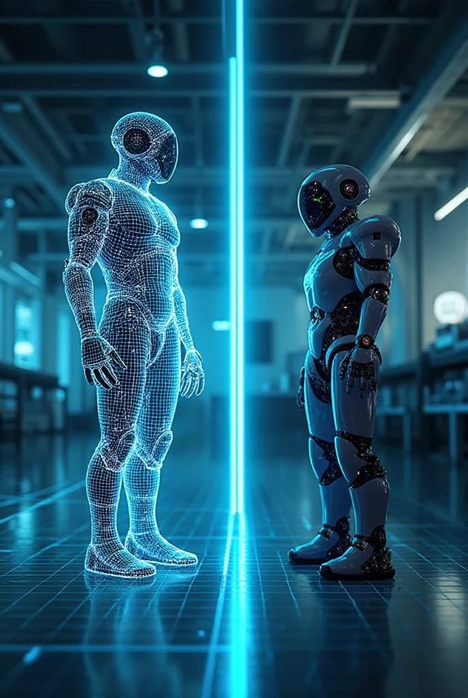

# Gazebo Simulation 1: Physics, Gravity, Collisions

:::info Learning Objectives
* Understand Gazebo's physics engine and its role in robot simulation
* Configure gravity, friction, and collision properties for humanoid robots
* Implement realistic physical interactions in simulation environments
* Optimize simulation parameters for performance and accuracy
:::



Gazebo is a powerful 3D simulation environment that provides realistic physics simulation for robotics applications. The physics engine is crucial for humanoid robots as it simulates real-world forces like *gravity*, *friction*, and *collision dynamics* that significantly impact robot behavior.

## Physics Engine Fundamentals

Gazebo uses the **Open Dynamics Engine (ODE)**, **Bullet**, or **Simbody** as its underlying physics engine. These engines calculate the motion of rigid bodies under the influence of forces and torques, enabling realistic simulation of robot interactions with the environment.

### Physics Configuration

The physics parameters in Gazebo are defined in the world file and can be adjusted for different simulation requirements:

```xml
<physics type="ode">
  <max_step_size>0.001</max_step_size>
  <real_time_factor>1.0</real_time_factor>
  <real_time_update_rate>1000.0</real_time_update_rate>
  <gravity>0 0 -9.8</gravity>
</physics>
```

:::tip Key Concept
The `max_step_size` parameter controls the simulation time step. Smaller values provide more accurate physics but require more computational resources. For humanoid robots, stability often requires smaller time steps.
:::

## Gravity and Its Impact on Humanoid Locomotion

Gravity is fundamental to humanoid robotics simulation as it affects balance, walking patterns, and interaction with surfaces. In Gazebo, gravity is defined as a 3D vector:

```xml
<gravity>0 0 -9.8</gravity>  <!-- Standard Earth gravity -->
<gravity>0 0 -3.7</gravity>  <!-- Mars gravity for planetary robotics -->
```

For humanoid robots, gravity affects:
- **Center of Mass (CoM)** calculations and balance control
- **Ground reaction forces** during walking
- **Stability margins** during dynamic movements

### Implementing Gravity Effects

```xml
<!-- Model with specific gravity considerations -->
<model name="humanoid_robot">
  <link name="base_link">
    <inertial>
      <mass value="75.0"/>  <!-- Human-like mass -->
      <inertia ixx="1.0" ixy="0.0" ixz="0.0" iyy="1.0" iyz="0.0" izz="1.0"/>
    </inertial>
    <collision name="collision">
      <geometry>
        <box size="0.3 0.3 0.3"/>
      </geometry>
    </collision>
  </link>
</model>
```

## Collision Detection and Response

Collision detection in Gazebo involves two phases:
1. **Broad phase**: Fast elimination of non-colliding pairs
2. **Narrow phase**: Precise collision detection and response calculation

### Collision Properties

```xml
<collision name="leg_collision">
  <geometry>
    <capsule length="0.4" radius="0.05"/>
  </geometry>
  <surface>
    <friction>
      <ode>
        <mu>0.5</mu>      <!-- Static friction coefficient -->
        <mu2>0.5</mu2>    <!-- Dynamic friction coefficient -->
      </ode>
    </friction>
    <bounce>
      <restitution_coefficient>0.1</restitution_coefficient>  <!-- Bounciness -->
      <threshold>100000.0</threshold>  <!-- Velocity threshold for bounce -->
    </bounce>
  </surface>
</collision>
```

## Optimizing Physics Parameters

For humanoid robots, specific parameters need careful tuning:

- **Contact stiffness**: Affects how rigidly objects interact
- **Damping**: Controls energy dissipation during contact
- **ERP (Error Reduction Parameter)**: Controls constraint violation correction
- **CFM (Constraint Force Mixing)**: Adds compliance to constraints

```bash
# Launch Gazebo with custom physics parameters
gzserver --physics-engine ode --max-step-size 0.001 my_humanoid_world.world
```

## Hands-on Lab

Configure a humanoid robot simulation with:
1. Proper gravity settings for Earth-like environment
2. Collision properties for stable walking
3. Friction coefficients for realistic ground interaction
4. Physics parameters optimized for humanoid locomotion
5. Test the simulation with simple walking patterns

## Self-Assessment

1. How does the physics time step affect humanoid robot simulation?
2. Why is gravity critical for humanoid locomotion simulation?
3. What are the key parameters for realistic collision behavior?