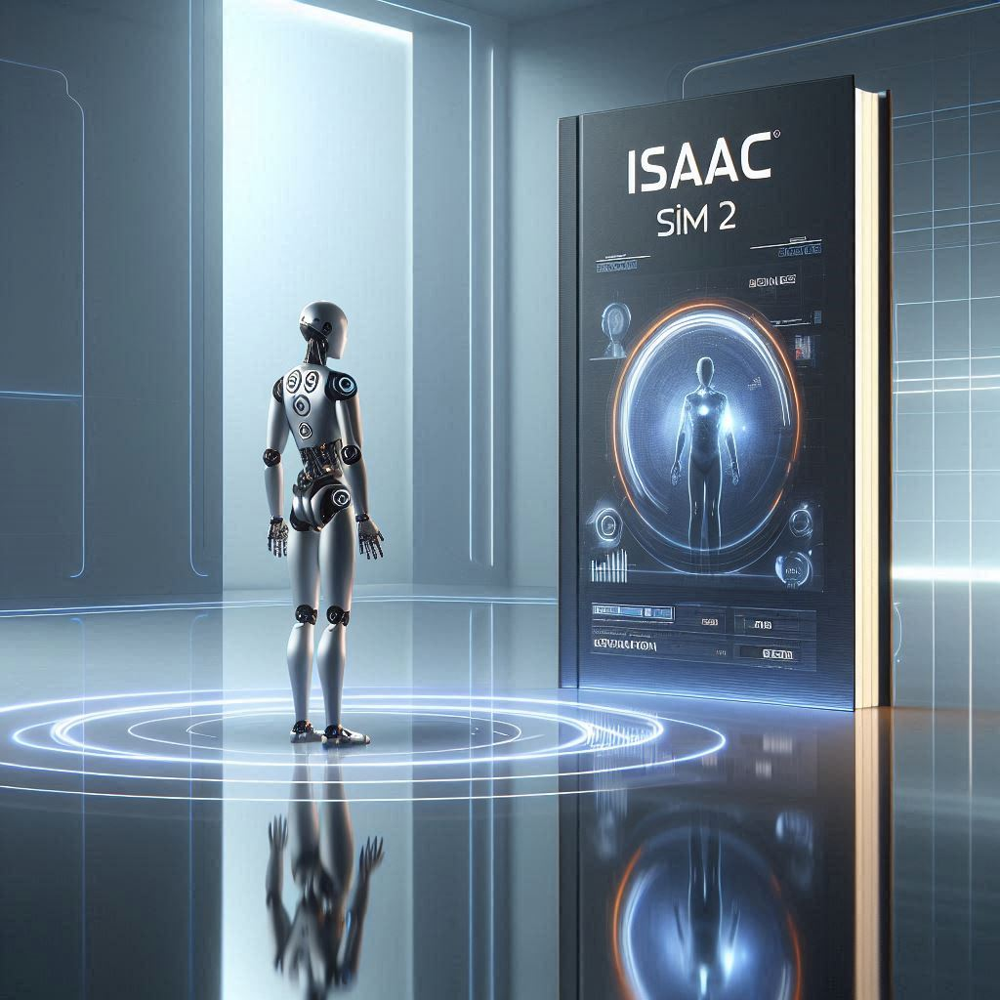

# Isaac Sim 2: Isaac ROS & Hardware Accelerated VSLAM

:::info Learning Objectives
* Understand Isaac ROS and its role in robotics applications
* Implement hardware-accelerated VSLAM algorithms using Isaac Sim
* Integrate perception pipelines with robotic platforms
* Optimize SLAM performance using GPU acceleration
:::




Isaac ROS is a collection of hardware-accelerated perception and navigation packages that bridge the gap between NVIDIA's GPU computing capabilities and ROS 2 robotics middleware. It enables high-performance computer vision and spatial perception for autonomous robots, particularly important for humanoid robots that require real-time scene understanding.

## Isaac ROS Architecture

Isaac ROS leverages NVIDIA's **CUDA**, **TensorRT**, and **OptiX** technologies to accelerate perception algorithms. The architecture includes:

- **Hardware acceleration**: GPU-optimized algorithms for real-time processing
- **ROS 2 integration**: Standard ROS 2 interfaces and message types
- **Modular design**: Reusable components for different robotic applications
- **Performance optimization**: Zero-copy memory transfers and efficient pipelines

### Key Isaac ROS Packages

```bash
# Isaac ROS packages for perception
isaac_ros_apriltag        # AprilTag detection and pose estimation
isaac_ros_dnn_inference   # Deep learning inference acceleration
isaac_ros_image_pipeline  # Image rectification and processing
isaac_ros_visual_slam     # Visual SLAM algorithms
isaac_ros_pointcloud_utils # Point cloud processing
```

:::tip Key Concept
Isaac ROS provides hardware-accelerated computer vision algorithms that can process sensor data in real-time, which is essential for humanoid robots that need to navigate and interact with dynamic environments.
:::

## Hardware Accelerated VSLAM

Visual SLAM (Simultaneous Localization and Mapping) in Isaac ROS uses GPU acceleration to process visual data and build maps of the environment while tracking the robot's position. This includes:

- **Feature detection**: Accelerated corner and edge detection
- **Feature matching**: GPU-parallelized descriptor matching
- **Pose estimation**: Real-time camera pose calculation
- **Map building**: Efficient 3D reconstruction

### Implementing VSLAM with Isaac ROS

```python
import rclpy
from rclpy.node import Node
from sensor_msgs.msg import Image
from geometry_msgs.msg import PoseStamped
from nav_msgs.msg import Odometry

class IsaacVSLAMNode(Node):
    def __init__(self):
        super().__init__('isaac_vs_lam_node')

        # Isaac ROS Visual SLAM publisher/subscriber
        self.image_sub = self.create_subscription(
            Image,
            '/camera/color/image_raw',
            self.image_callback,
            10
        )

        self.odom_pub = self.create_publisher(
            Odometry,
            '/visual_slam/odometry',
            10
        )

    def image_callback(self, msg):
        # Process image with Isaac ROS accelerated pipeline
        # This would connect to Isaac ROS Visual SLAM node
        pass

def main(args=None):
    rclpy.init(args=args)
    vs_lam_node = IsaacVSLAMNode()
    rclpy.spin(vs_lam_node)
    rclpy.shutdown()
```

## Isaac Sim Integration for SLAM Training

Isaac Sim provides realistic sensor data for training and validating SLAM algorithms:

```python
from omni.isaac.core import World
from omni.isaac.sensor import Camera
import numpy as np

class SLAMTrainer:
    def __init__(self):
        self.world = World(stage_units_in_meters=1.0)
        self.camera = Camera(
            prim_path="/World/Camera",
            position=np.array([0.0, 0.0, 1.0]),
            frequency=30
        )

    def generate_training_data(self):
        """Generate realistic sensor data for SLAM training"""
        rgb_data = self.camera.get_rgb()
        depth_data = self.camera.get_depth()
        pose_data = self.get_ground_truth_pose()

        return {
            'rgb': rgb_data,
            'depth': depth_data,
            'pose': pose_data
        }
```

## Performance Optimization

Isaac ROS optimizes performance through:

- **CUDA streams**: Parallel processing of multiple data streams
- **Memory management**: GPU memory pools for efficient allocation
- **Pipeline optimization**: Minimizing data transfers between CPU and GPU
- **Multi-threading**: Concurrent processing of different algorithm stages

### Example Optimization Pattern

```bash
# Launch Isaac ROS Visual SLAM with performance parameters
ros2 launch isaac_ros_visual_slam visual_slam.launch.py \
  use_viz:=false \
  enable_rectification:=true \
  map_frame:=map \
  odom_frame:=odom \
  base_frame:=base_link \
  debug_mode:=false
```

## Hands-on Lab

Implement a hardware-accelerated VSLAM system with:
1. Isaac ROS Visual SLAM node configuration
2. Camera integration with Isaac Sim
3. Performance optimization settings
4. Real-time mapping and localization
5. Visualization of the generated map

## Self-Assessment

1. What are the key advantages of Isaac ROS over traditional ROS packages?
2. How does hardware acceleration improve VSLAM performance?
3. What are the main components of Isaac ROS architecture?